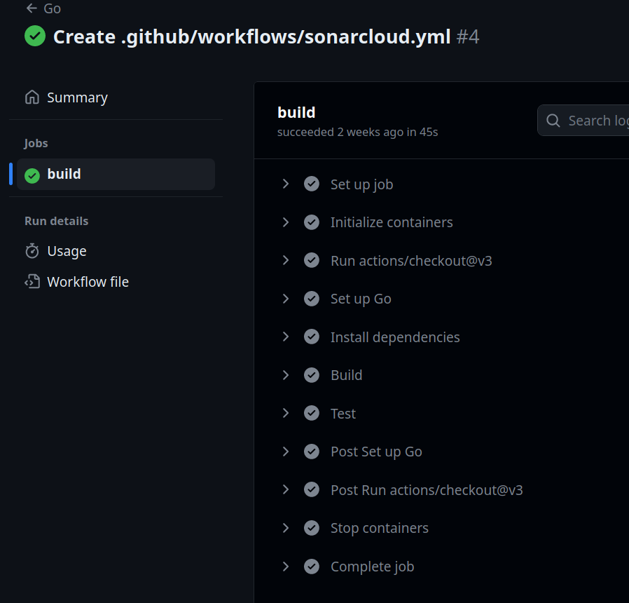

:author: Fabian Haas
:listing-caption: Listing
:source-highlighter: rouge
// path to the directory containing the source code
:src: ../src
// path to the directory containing the images
:toc:
:numbered:
:toclevels: 3
:rouge-style: github
:pdf-themesdir: ./doc/theme
:pdf-theme: basic
:pdf-fontsdir: ./doc/fonts
// front-cover-image can be used to include the Exercise specification, for example:
//:front-cover-image: ./Exercise1.pdf

= Go-mux

== Exercise 3: CI workflow

=== Go action

I used Github actions to create a CI workflow for the project.
The workflow to build and run the tests is defined in `.github/workflows/go.yml` and runs on every push to the repository.

The workflow first sets up the postgres database needed for the tests as a service.
It uses `actions/checkout@v3` to checkout the repository and `actions/setup-go@v4` to setup the required go environment, after which it installs the dependencies with `go mod download`. Once the dependencies are installed, the project is build with `go build` and the tests are run with `go test`.

.go.yml
[source,yaml]
----
include::.github/workflows/go.yml[]
----

This should display the status of the workflow

=== SonarCloud action

I used the sonarcloud template to create my workflow for the sonarcloud analysis.

.sonarcloud.yml
[source,yaml]
----
include::.github/workflows/sonarcloud.yml[]
----

== Setup

For running this application you need to have docker installed and fire up a postgres database with this command:

 docker run -it -p 5432:5432 -e POSTGRES_HOST_AUTH_METHOD=trust -d postgres

Following this, you should set up the following environment variables:

 export APP_JWT_SECRET=postgres
 export APP_DB_USERNAME=postgres
 export APP_DB_PASSWORD=
 export APP_DB_NAME=postgres

The test can be run via:

 go test -v
